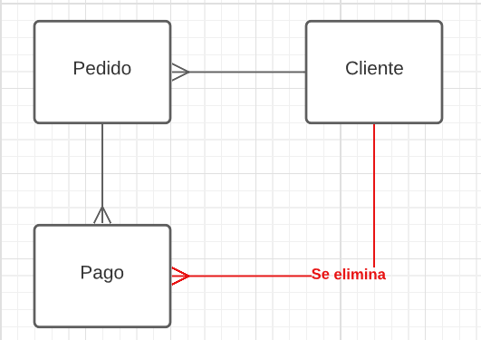

# DB-NOTES

## Indice

- [DB-NOTES](#db-notes)
  - [Indice](#indice)
  - [Propiedades de las relaciones](#propiedades-de-las-relaciones)
  - [Tipos de reglas](#tipos-de-reglas)
  - [SUPERKEY](#superkey)
  - [FORÁNEAS](#foráneas)
    - [REGLAS DEL NEGOCIO](#reglas-del-negocio)
  - [DELETE borrar](#delete-borrar)
  - [UPDATE actualizar](#update-actualizar)
  - [DIAGRAMAS](#diagramas)
    - [DIAGRAMA ER DE PETER CHEN](#diagrama-er-de-peter-chen)
    - [ENTIDAD RELACIÓN](#entidad-relación)
  - [RELACIONES](#relaciones)
    - [CARDINALIDAD](#cardinalidad)
      - [1 a 1](#1-a-1)
      - [1 a muchos](#1-a-muchos)
  - [RECURSOS QUE ME SIRVIERON PARA ORACLE](#recursos-que-me-sirvieron-para-oracle)

## Propiedades de las relaciones

el nombre de los atributos es `tabla.atributo`

fila es un objeto
tabla es una clase
atributo es una columna

cada fila es diferente ya que debe tener un primary key

orden de las columnas no es importantes

## Tipos de reglas

- ### Integridad de dominio
  
  implica que el tipos de una columnas deben cumplir unas restricciones **ejemplo:** columna street debe ser una cadena de 25 caracteres `street: character:size 25`

  - **not null:** indica que el valor es obligatorio
  - **check:** condición sencilla(depende de cada DBMS)

- ### Integridad de entidad

nunca una llave primaria puede ser vacia ni puede estar repetida por el principio de unicidad

- ### Integridad referencial

si una llave foranea tiene un valor debe coincidir con la primaria de una tabla
ocurre cuando:

- (INSERT)se intenta insertar un hijo que no tiene padre
- (UPDATE)se intenta actualizar la clave foránea, es decir, en el hijo por la de un padre que no existe
- (DELETE)se intenta eliminar un padre que tiene hijos
- (UPDATE)se intenta actualizar la clave primaria de un padre que tiene hijos dejandolos huérfanos

## SUPERKEY

La superkey es una clave compuesta donde se usa la minima cantida de columnas que sean únicas

`llave alterna: es otro valor que no se repite pero no hay otra que es más candidata`

## FORÁNEAS

las foraneas siempre son muchos y pueden ser nulas

### REGLAS DEL NEGOCIO

restricciones que el negocio coloca **ejemplo:** en un banco debe colocar el telefono sino como se va a contactar, pero en una empresa un empleado puede decidir si quiere o no colocar el telefono

## DELETE borrar

- borrar: no borra si tiene hijos
- cascada en borrado: borrar y borrar todos los hijos
- borrar por nulos: quitar los padres de la entidad a borrar
  
## UPDATE actualizar

- por restricion: no deja si tiene hijos
- por cascada: va a cada hijo y los actualiza
- por nulos: busca los hijos y los pone en nulos

"cuando en el ejercicio dice que se elimina por cascada se asume que todas serán eleminadas por cascada"

## DIAGRAMAS

### DIAGRAMA ER DE PETER CHEN

Se usan rectangulos para representar entidades, se usan rombos para representar relaciones(ACCIONES), y se usan óvalos para representar los atributos, no se usa mucho

### ENTIDAD RELACIÓN

todos son rectangulos y las relaciones no obligatorias(PUEDE) son representadas con una linea punteada y las relaciones obligatorias(DEBE) son representadas con una linea sólida

## RELACIONES

Según Connolly las relaciones son tablas con filas ahora diremos que las relaciones son asociaciones con otras tablas

`datazo 1: cuando una "entidad" tiene una sola instancia, no es realmente una entidad y hay que reconsiderarlo`

`datazo 2: cuando hay una redundancia se debe eliminar la ruta más corta`

### CARDINALIDAD

#### 1 a 1

1 persona - tiene - 1 dato_contacto 1 dato_contacto - tiene - 1 persona.

#### 1 a muchos

Un dueño tiene N automóviles, pero 1 automóvil solo tiene 1 dueño.

## RECURSOS QUE ME SIRVIERON PARA ORACLE

- [buena documentación de oracle](https://www.oracletutorial.com/)
- [otra pagina de buena documentación oracle](https://ora.u440.com/)
- [Restricciones: eliminación (alter table - drop constraint)](https://www.tutorialesprogramacionya.com/oracleya/temarios/descripcion.php?cod=200&punto=1&inicio=)
- [2 - Valores por defecto (default)](https://www.tutorialesprogramacionya.com/oracleya/simulador/simulador.php?cod=176&punto=2&inicio=)
- [select](https://jorgesanchez.net/manuales/sql/select-basico-sql2016.html)
- [alter](https://www.techonthenet.com/oracle/tables/alter_table.php)
